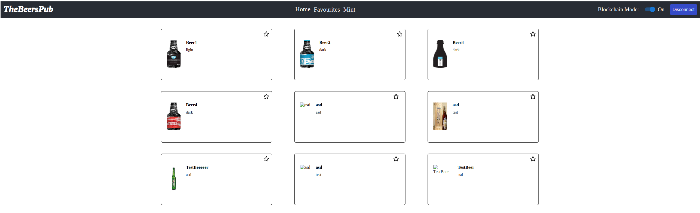

# TheBeersPub | NextJS

The objective of the project is to read data either from api or blockchain contracts. There is also options for adding favourites, as well as minting new beers on the ethereum contracts.

# Concerns

1) The Application is not designed for mobile devices. CSS @media querys should be applied.
2) Favourites should be saved to backend database, ex. NodeJS + Mongo
3) Hashing of the favourites can be done more securely using advanced packages, for example bcrypt.

# To-Do List:
1) Add unit tests.

# Dependencies
1. Node 20.0.0 or greater.

# Setup
1. Install packages
```bash
npm install

```
2. Run the frontend.
```bash
npm run dev
```

# Screenshots

1) Default View


2) Blockchain Mode, connect account


3) Data fetched from Ethereum Contract

